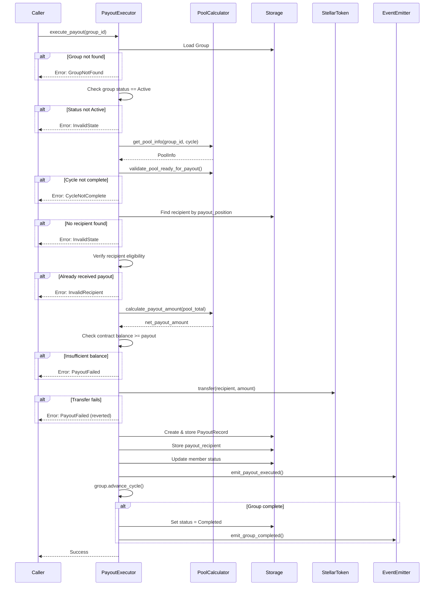

# Design Document: Payout Execution

## Overview

The payout execution feature implements the core fund distribution mechanism for the Stellar-Save ROSCA (Rotational Savings and Credit Association) smart contract. This feature orchestrates the automated transfer of pooled funds to eligible recipients when a savings cycle completes.

In a ROSCA, members contribute a fixed amount each cycle, and one designated member receives the total pool each cycle in a predetermined rotation order. The payout executor is responsible for:

- Verifying cycle completion (all members have contributed)
- Identifying the correct recipient based on payout position
- Calculating the payout amount (pool total minus fees)
- Executing the fund transfer via Stellar's token system
- Recording the payout for audit and transparency
- Updating member status to track who has received payouts
- Advancing the cycle or marking the group as complete
- Emitting events for frontend notification

The design follows a permissionless execution model where any address can trigger payout execution once preconditions are met, ensuring the system remains decentralized and resistant to single points of failure.

### Key Design Principles

1. **Atomicity**: All payout operations succeed or fail as a unit - no partial state changes
2. **Transparency**: Every payout creates an immutable audit record
3. **Safety**: Multiple validation layers prevent incorrect distributions
4. **Permissionless**: Anyone can trigger payouts when conditions are met
5. **Integration**: Seamless use of existing modules (PoolCalculator, StorageKeyBuilder, EventEmitter)

## Architecture

### System Context

The payout executor sits at the intersection of several existing contract modules:

```
┌─────────────────────────────────────────────────────────────┐
│                    External Caller                          │
│              (Any address - permissionless)                 │
└────────────────────────┬────────────────────────────────────┘
                         │
                         │ execute_payout(group_id)
                         ▼
┌─────────────────────────────────────────────────────────────┐
│                   Payout Executor                           │
│  ┌──────────────────────────────────────────────────────┐  │
│  │ 1. Validate Group & Status                           │  │
│  │ 2. Verify Cycle Completion (PoolCalculator)          │  │
│  │ 3. Identify Recipient (Member Profiles)              │  │
│  │ 4. Calculate Payout Amount (PoolCalculator)          │  │
│  │ 5. Execute Transfer (Stellar Token API)              │  │
│  │ 6. Record Payout (PayoutRecord)                      │  │
│  │ 7. Update Member Status                              │  │
│  │ 8. Emit Events (EventEmitter)                        │  │
│  │ 9. Advance Cycle (Group.advance_cycle)               │  │
│  └──────────────────────────────────────────────────────┘  │
└─────────────────────────────────────────────────────────────┘
                         │
         ┌───────────────┼───────────────┐
         │               │               │
         ▼               ▼               ▼
┌────────────────┐ ┌──────────┐ ┌──────────────┐
│ PoolCalculator │ │ Storage  │ │ EventEmitter │
│   - get_pool   │ │  - Group │ │  - Payout    │
│   - validate   │ │  - Member│ │    Executed  │
└────────────────┘ └──────────┘ └──────────────┘
```

### Module Dependencies

The payout executor depends on:

- **PoolCalculator**: Validates cycle completion and calculates payout amounts
- **StorageKeyBuilder**: Generates consistent storage keys for all data access
- **EventEmitter**: Publishes payout events for frontend consumption
- **Group**: Manages group state and cycle advancement
- **PayoutRecord**: Structures payout data for storage
- **MemberProfile**: Tracks member payout positions and eligibility
- **StellarSaveError**: Provides standardized error handling

### Execution Flow



## Components and Interfaces

### Primary Function: execute_payout

```rust
pub fn execute_payout(env: Env, group_id: u64) -> Result<(), StellarSaveError>
```

The main entry point for payout execution. This function is permissionless - any address can call it.

**Parameters:**
- `env`: Soroban environment for storage and ledger access
- `group_id`: Unique identifier of the group to process payout for

**Returns:**
- `Ok(())`: Payout successfully executed
- `Err(StellarSaveError)`: Payout failed with specific error code

**Error Conditions:**
- `GroupNotFound`: Group ID does not exist
- `InvalidState`: Group not in Active status or cycle not ready
- `CycleNotComplete`: Not all members have contributed
- `InvalidRecipient`: Recipient not eligible or already received payout
- `InvalidAmount`: Calculated payout amount is invalid
- `PayoutFailed`: Fund transfer failed
- `InternalError`: Storage or state update failed
- `Overflow`: Arithmetic overflow in calculations

### Helper Functions

#### validate_cycle_complete

```rust
fn validate_cycle_complete(
    env: &Env,
    group_id: u64,
    current_cycle: u32
) -> Result<PoolInfo, StellarSaveError>
```

Validates that the current cycle is complete and ready for payout.

**Logic:**
1. Call `PoolCalculator::get_pool_info(env, group_id, current_cycle)`
2. Call `PoolCalculator::validate_pool_ready_for_payout(&pool_info)`
3. Return pool_info if valid, error otherwise

**Returns:**
- `Ok(PoolInfo)`: Cycle is complete with pool information
- `Err(CycleNotComplete)`: Not all members have contributed
- `Err(InvalidAmount)`: Contribution totals don't match expected pool

#### identify_recipient

```rust
fn identify_recipient(
    env: &Env,
    group_id: u64,
    current_cycle: u32,
    member_count: u32
) -> Result<Address, StellarSaveError>
```

Identifies the member who should receive the payout for the current cycle.

**Logic:**
1. Iterate through all members in the group
2. For each member, load their MemberProfile
3. Find the member whose `payout_position == current_cycle`
4. Verify only one member has this position
5. Return the recipient address

**Returns:**
- `Ok(Address)`: The recipient's address
- `Err(InvalidState)`: No member found with matching position or multiple members with same position

#### verify_recipient_eligibility

```rust
fn verify_recipient_eligibility(
    env: &Env,
    group_id: u64,
    recipient: &Address
) -> Result<(), StellarSaveError>
```

Verifies that the identified recipient is eligible to receive the payout.

**Checks:**
1. Recipient is a current member of the group
2. Recipient has not already received a payout in this group
3. Recipient's payout position matches the current cycle

**Returns:**
- `Ok(())`: Recipient is eligible
- `Err(NotMember)`: Recipient is not a member
- `Err(InvalidRecipient)`: Recipient already received payout

#### execute_transfer

```rust
fn execute_transfer(
    env: &Env,
    recipient: &Address,
    amount: i128
) -> Result<(), StellarSaveError>
```

Executes the fund transfer from the contract to the recipient.

**Implementation Note:**
In Soroban, the contract holds funds in its own balance. The transfer mechanism depends on the token type:
- For native XLM: Use the Stellar Account API
- For custom tokens: Use the token contract's transfer function

For this design, we assume native XLM transfers using Soroban's built-in transfer functionality.

**Logic:**
1. Get contract address
2. Verify contract balance >= amount
3. Execute transfer from contract to recipient
4. Handle transfer errors

**Returns:**
- `Ok(())`: Transfer successful
- `Err(PayoutFailed)`: Transfer failed (insufficient funds, invalid recipient, etc.)

#### record_payout

```rust
fn record_payout(
    env: &Env,
    group_id: u64,
    cycle: u32,
    recipient: Address,
    amount: i128,
    timestamp: u64
) -> Result<(), StellarSaveError>
```

Creates and stores an immutable payout record.

**Storage Operations:**
1. Create `PayoutRecord` with all payout details
2. Store at `StorageKeyBuilder::payout_record(group_id, cycle)`
3. Store recipient address at `StorageKeyBuilder::payout_recipient(group_id, cycle)`
4. Validate record before storage

**Returns:**
- `Ok(())`: Record stored successfully
- `Err(InternalError)`: Storage operation failed

#### update_member_status

```rust
fn update_member_status(
    env: &Env,
    group_id: u64,
    recipient: &Address
) -> Result<(), StellarSaveError>
```

Updates the recipient's member profile to reflect payout completion.

**Logic:**
1. Load MemberProfile for recipient
2. Mark as having received payout (implementation-specific flag or check via payout_recipient storage)
3. Save updated profile

**Note:** The current architecture tracks payout receipt via the `payout_recipient` storage key rather than a flag in MemberProfile. This function ensures consistency between payout records and member status queries.

**Returns:**
- `Ok(())`: Status updated successfully
- `Err(InternalError)`: Update failed

#### advance_cycle_or_complete

```rust
fn advance_cycle_or_complete(
    env: &Env,
    group: &mut Group
) -> Result<(), StellarSaveError>
```

Advances the group to the next cycle or marks it as complete.

**Logic:**
1. Call `group.advance_cycle(env)`
2. If `group.is_complete()` returns true:
   - Group status is automatically set to Completed by advance_cycle
   - GroupCompleted event is automatically emitted by advance_cycle
3. Save updated group to storage

**Returns:**
- `Ok(())`: Cycle advanced successfully
- `Err(InternalError)`: State update failed

### Integration Points

#### PoolCalculator Integration

```rust
// Get comprehensive pool information
let pool_info = PoolCalculator::get_pool_info(&env, group_id, current_cycle)?;

// Validate pool is ready for payout
PoolCalculator::validate_pool_ready_for_payout(&pool_info)?;

// Calculate net payout amount
let payout_amount = PoolCalculator::calculate_payout_amount(pool_info.total_pool_amount)?;
```

#### StorageKeyBuilder Integration

```rust
// Group data
let group_key = StorageKeyBuilder::group_data(group_id);
let group = env.storage().persistent().get::<_, Group>(&group_key)?;

// Member profile
let member_key = StorageKeyBuilder::member_profile(group_id, address);
let profile = env.storage().persistent().get::<_, MemberProfile>(&member_key)?;

// Payout record
let payout_key = StorageKeyBuilder::payout_record(group_id, cycle);
env.storage().persistent().set(&payout_key, &payout_record);

// Payout recipient
let recipient_key = StorageKeyBuilder::payout_recipient(group_id, cycle);
env.storage().persistent().set(&recipient_key, &recipient);
```

#### EventEmitter Integration

```rust
// Emit payout executed event
EventEmitter::emit_payout_executed(
    &env,
    group_id,
    recipient.clone(),
    payout_amount,
    current_cycle,
    timestamp
);

// Emit group completed event (if applicable)
EventEmitter::emit_group_completed(
    &env,
    group_id,
    group.creator.clone(),
    group.max_members,
    total_distributed,
    timestamp
);
```

## Data Models

### PayoutRecord (Existing)

```rust
pub struct PayoutRecord {
    pub recipient: Address,
    pub group_id: u64,
    pub cycle_number: u32,
    pub amount: i128,
    pub timestamp: u64,
}
```

This structure already exists in `payout.rs` and provides:
- Immutable audit trail of payouts
- Validation via `validate()` method
- Helper methods for querying payout details

### MemberProfile (Existing)

```rust
pub struct MemberProfile {
    pub address: Address,
    pub group_id: u64,
    pub payout_position: u32,
    pub joined_at: u64,
}
```

Tracks member participation and payout turn order. The `payout_position` field (0-indexed) determines when a member receives their payout.

### Group (Existing)

```rust
pub struct Group {
    pub id: u64,
    pub creator: Address,
    pub contribution_amount: i128,
    pub cycle_duration: u64,
    pub max_members: u32,
    pub min_members: u32,
    pub member_count: u32,
    pub current_cycle: u32,
    pub is_active: bool,
    pub status: GroupStatus,
    pub created_at: u64,
    pub started: bool,
    pub started_at: u64,
}
```

The Group struct includes the `advance_cycle(&env)` method which:
- Increments `current_cycle`
- Sets `status = Completed` and `is_active = false` when `current_cycle >= max_members`
- Emits `GroupCompleted` event automatically

### PoolInfo (Existing)

```rust
pub struct PoolInfo {
    pub group_id: u64,
    pub cycle: u32,
    pub member_count: u32,
    pub contribution_amount: i128,
    pub total_pool_amount: i128,
    pub current_contributions: i128,
    pub contributors_count: u32,
    pub is_cycle_complete: bool,
}
```

Provides comprehensive cycle status information from PoolCalculator.

### Storage Keys

The payout executor uses these storage keys:

```rust
// Group data
StorageKey::Group(GroupKey::Data(group_id))

// Group members list
StorageKey::Group(GroupKey::Members(group_id))

// Member profile with payout position
StorageKey::Member(MemberKey::Profile(group_id, address))

// Payout record for audit trail
StorageKey::Payout(PayoutKey::Record(group_id, cycle))

// Payout recipient for quick lookup
StorageKey::Payout(PayoutKey::Recipient(group_id, cycle))
```

### State Transitions

```
Group Status Flow:
Pending → Active → Completed
                 ↓
              Cancelled

Payout Flow:
No Payout → Payout Executed → Cycle Advanced → (Next Cycle or Completed)
```


## Correctness Properties

*A property is a characteristic or behavior that should hold true across all valid executions of a system-essentially, a formal statement about what the system should do. Properties serve as the bridge between human-readable specifications and machine-verifiable correctness guarantees.*

### Property Reflection

After analyzing all acceptance criteria, I identified several areas of redundancy:

1. **Cycle Completion Validation**: Criteria 1.1, 1.2, 1.3, and 1.5 all relate to validating cycle completion. These can be combined into a single comprehensive property.

2. **Atomicity**: Criteria 4.2, 5.5, 6.4, 8.6, and 10.2 all test atomicity (revert on failure). These can be combined into one general atomicity property (10.5).

3. **Balance Verification**: Criteria 3.5 and 4.4 both check sufficient contract balance. These are redundant.

4. **Member Status Updates**: Criteria 6.1, 6.2, and 6.3 all relate to updating member status after payout. These can be combined.

5. **Group Status Validation**: Criteria 9.4 and 11.6 both check that group status is Active. These are redundant.

6. **Permissionless Execution**: Criteria 9.1, 9.2, and 9.3 all relate to permissionless access. These can be combined.

7. **Payout Record Consistency**: Criteria 5.1, 5.3, 5.4, and 6.5 relate to payout record creation and consistency. These can be combined.

8. **Group Completion**: Criteria 8.2 and 8.3 both test marking groups as complete. These are redundant.

After reflection, the unique testable properties are:

### Property 1: Cycle Completion Validation

*For any* group and cycle, payout execution should only succeed when all members have contributed and the total contributions equal the expected pool amount (contribution_amount × member_count).

**Validates: Requirements 1.1, 1.2, 1.3, 1.5**

### Property 2: Correct Recipient Identification

*For any* group at any cycle, the payout executor should identify exactly one recipient whose payout_position matches the current cycle number, and that recipient must be a current member who has not already received a payout.

**Validates: Requirements 2.1, 2.2, 2.3, 2.4, 2.5**

### Property 3: Payout Amount Calculation

*For any* pool with total amount T and fees F, the net payout amount should equal T - F, and should be rejected if the result is ≤ 0.

**Validates: Requirements 3.2, 3.4**

### Property 4: Sufficient Balance Verification

*For any* payout execution, the contract balance must be greater than or equal to the payout amount before the transfer is initiated.

**Validates: Requirements 3.5**

### Property 5: Successful Transfer Updates Balance

*For any* successful payout transfer of amount A to recipient R, the recipient's balance should increase by A and the contract's balance should decrease by A.

**Validates: Requirements 4.1**

### Property 6: Transaction Atomicity

*For any* payout execution that fails at any step (validation, transfer, storage, or cycle advancement), all state changes must be reverted and the system must return to its pre-execution state.

**Validates: Requirements 4.2, 5.5, 6.4, 8.6, 10.1, 10.2, 10.5**

### Property 7: Payout Record Completeness and Consistency

*For any* successful payout execution, a PayoutRecord must be created containing recipient, group_id, cycle_number, amount, and timestamp, and this record must be retrievable via both the payout_record and payout_recipient storage keys, and must pass validation.

**Validates: Requirements 5.1, 5.3, 5.4, 6.5**

### Property 8: Member Status Update After Payout

*For any* member who receives a payout, subsequent queries for that member's payout eligibility in that group must return false, and the member must appear in the payout recipient records.

**Validates: Requirements 6.1, 2.4**

### Property 9: Payout Event Emission

*For any* successful payout execution, a PayoutExecuted event must be emitted containing group_id, recipient, amount, cycle, and timestamp.

**Validates: Requirements 7.1, 7.2**

### Property 10: Event Emission Non-Critical

*For any* payout execution where event emission fails, the payout transaction should still succeed and all state changes should be persisted.

**Validates: Requirements 7.5**

### Property 11: Cycle Advancement

*For any* successful payout execution, the group's current_cycle should be incremented by exactly 1.

**Validates: Requirements 8.1**

### Property 12: Group Completion Detection

*For any* group where current_cycle + 1 equals max_members after a payout, the group status should be set to Completed, is_active should be false, and a GroupCompleted event should be emitted.

**Validates: Requirements 8.2, 8.4**

### Property 13: Permissionless Execution

*For any* address A and group G where G is ready for payout, address A should be able to successfully execute the payout regardless of whether A is the creator, recipient, or any other address.

**Validates: Requirements 9.1, 9.2**

### Property 14: Active Status Requirement

*For any* group with status other than Active, payout execution should fail with InvalidState error.

**Validates: Requirements 9.4**

### Property 15: Payout Idempotency

*For any* group and cycle where a payout has already been executed, subsequent payout execution attempts for the same cycle should fail with PayoutAlreadyProcessed or InvalidState error.

**Validates: Requirements 9.5**

### Property 16: Overflow Detection

*For any* calculation during payout execution that would result in arithmetic overflow, the operation should fail with an Overflow error.

**Validates: Requirements 10.4**

### Property 17: Group Existence Validation

*For any* group_id that does not exist in storage, payout execution should fail with GroupNotFound error before performing any other operations.

**Validates: Requirements 10.6, 10.7**

## Error Handling

The payout executor implements comprehensive error handling with specific error codes for each failure condition:

### Error Categories

**Validation Errors** (fail fast, no state changes):
- `GroupNotFound` (1001): Group ID does not exist
- `InvalidState` (1003): Group not Active, cycle not ready, or invalid configuration
- `NotMember` (2002): Recipient is not a member
- `InvalidAmount` (3001): Payout amount is invalid (≤ 0 or exceeds balance)
- `CycleNotComplete` (3003): Not all members have contributed
- `InvalidRecipient` (4003): Recipient not eligible or already received payout

**Execution Errors** (trigger rollback):
- `PayoutFailed` (4001): Fund transfer failed
- `InternalError` (9001): Storage or state update failed
- `Overflow` (9003): Arithmetic overflow in calculations

### Error Handling Strategy

1. **Validation Phase**: All validation checks occur before any state modifications. If validation fails, return error immediately with no side effects.

2. **Execution Phase**: Once validation passes, execute operations in order:
   - Transfer funds (if fails, automatic rollback via Soroban)
   - Record payout (if fails, rollback)
   - Update member status (if fails, rollback)
   - Emit events (if fails, continue - events are non-critical)
   - Advance cycle (if fails, rollback)

3. **Atomicity Guarantee**: Soroban's transaction model ensures that if any operation fails after the transfer, all changes are automatically reverted. The contract must not catch and suppress errors that should trigger rollback.

### Error Recovery

For validation errors, the caller should:
- Wait for cycle completion if `CycleNotComplete`
- Check group status if `InvalidState`
- Verify group exists if `GroupNotFound`

For execution errors, the caller should:
- Retry the transaction (may succeed if transient issue)
- Check contract balance if `PayoutFailed`
- Report to admin if `InternalError` persists

## Testing Strategy

The payout execution feature requires both unit tests and property-based tests to ensure correctness across all scenarios.

### Unit Testing Approach

Unit tests focus on specific examples, edge cases, and integration points:

**Happy Path Tests:**
- Execute payout for a 3-member group in cycle 0
- Execute payout for a 5-member group in cycle 2
- Execute final payout that completes a group

**Edge Case Tests:**
- Payout with zero fees (v1 default)
- Payout for minimum group size (2 members)
- Payout for maximum group size
- First payout in a group (cycle 0)
- Last payout in a group (cycle = max_members - 1)

**Error Condition Tests:**
- Attempt payout on non-existent group
- Attempt payout on Pending group
- Attempt payout on Completed group
- Attempt payout with incomplete cycle
- Attempt payout with insufficient contract balance
- Attempt duplicate payout for same cycle
- Attempt payout with no matching recipient
- Attempt payout with multiple members at same position

**Integration Tests:**
- Verify PoolCalculator integration
- Verify StorageKeyBuilder usage
- Verify EventEmitter integration
- Verify Group.advance_cycle integration
- Verify PayoutRecord creation and validation

### Property-Based Testing Approach

Property tests verify universal properties across randomized inputs (minimum 100 iterations per test):

**Test Configuration:**
- Use `proptest` or `quickcheck` for Rust
- Minimum 100 iterations per property
- Generate random groups with varying sizes (2-20 members)
- Generate random contribution amounts (1-1000 XLM)
- Generate random cycle states (complete/incomplete)

**Property Test Suite:**

Each property test must include a comment tag referencing the design document:

```rust
// Feature: payout-execution, Property 1: Cycle Completion Validation
#[test]
fn prop_payout_requires_complete_cycle() {
    // Generate random group with random contribution state
    // Verify payout only succeeds when cycle is complete
}

// Feature: payout-execution, Property 2: Correct Recipient Identification
#[test]
fn prop_identifies_correct_recipient() {
    // Generate random group with random payout positions
    // Verify correct recipient is identified for each cycle
}

// Feature: payout-execution, Property 6: Transaction Atomicity
#[test]
fn prop_atomicity_on_failure() {
    // Generate random group and inject failures at various points
    // Verify state is unchanged after any failure
}

// Feature: payout-execution, Property 11: Cycle Advancement
#[test]
fn prop_cycle_increments_by_one() {
    // Generate random group at random cycle
    // Execute payout and verify cycle increased by exactly 1
}
```

**Generator Strategies:**

```rust
// Generate valid groups
fn arb_group() -> impl Strategy<Value = Group> {
    (2u32..=20, 1_000_000i128..=1_000_000_000i128)
        .prop_map(|(members, amount)| {
            create_test_group(members, amount)
        })
}

// Generate groups with complete cycles
fn arb_complete_cycle_group() -> impl Strategy<Value = (Group, u32)> {
    arb_group().prop_flat_map(|group| {
        let cycle = 0..group.max_members;
        (Just(group), cycle)
    }).prop_map(|(group, cycle)| {
        // Simulate all members contributing
        (group, cycle)
    })
}

// Generate groups with incomplete cycles
fn arb_incomplete_cycle_group() -> impl Strategy<Value = (Group, u32)> {
    arb_group().prop_flat_map(|group| {
        let cycle = 0..group.max_members;
        let contributors = 0..group.member_count;
        (Just(group), cycle, contributors)
    }).prop_filter(|(group, _, contributors)| {
        *contributors < group.member_count
    })
}
```

### Test Coverage Goals

- **Line Coverage**: > 90% of payout executor code
- **Branch Coverage**: > 85% of conditional branches
- **Property Coverage**: 100% of correctness properties tested
- **Error Path Coverage**: 100% of error conditions tested

### Testing Best Practices

1. **Isolation**: Each test should set up its own environment and not depend on other tests
2. **Clarity**: Test names should clearly describe what is being tested
3. **Assertions**: Use specific assertions that provide clear failure messages
4. **Cleanup**: Tests should clean up any resources they create
5. **Determinism**: Tests should be deterministic and not rely on timing or external state
6. **Documentation**: Complex test scenarios should include comments explaining the setup

### Continuous Integration

All tests must pass before merging:
- Unit tests run on every commit
- Property tests run on every pull request
- Integration tests run nightly
- Performance tests run weekly

